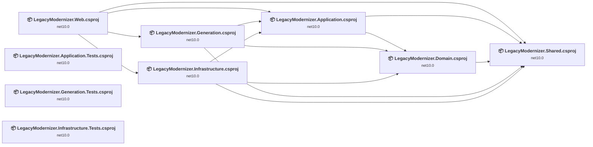
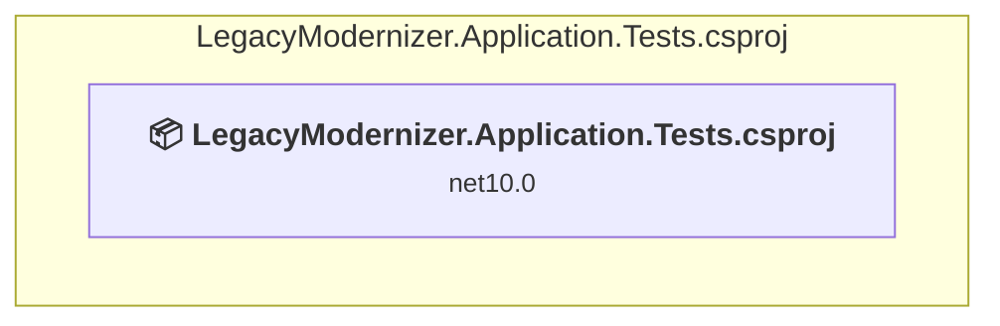
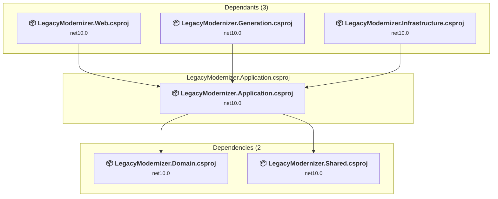
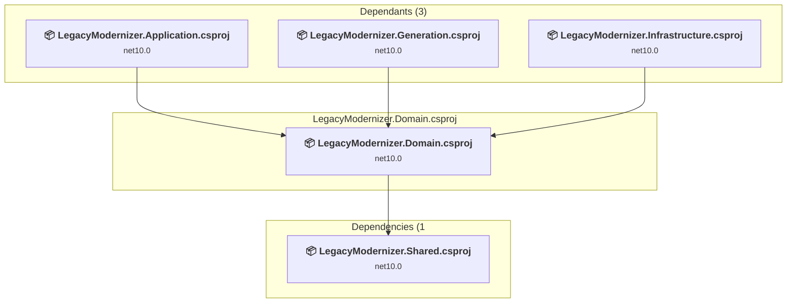
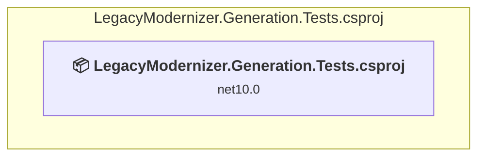
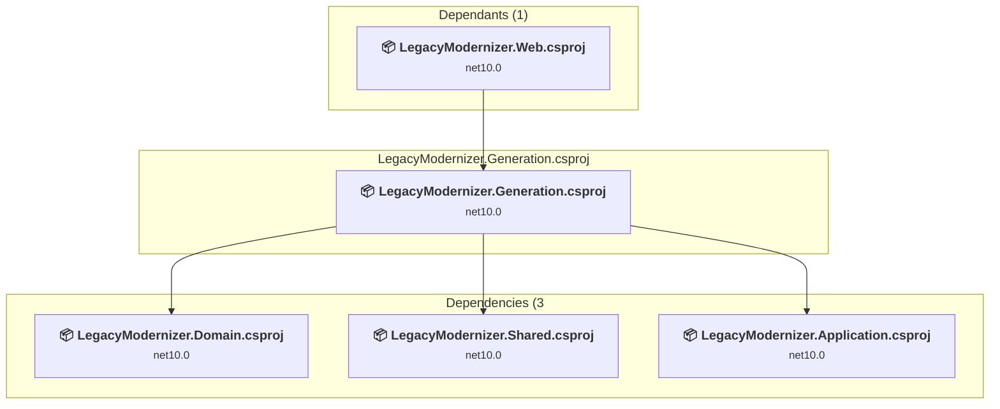
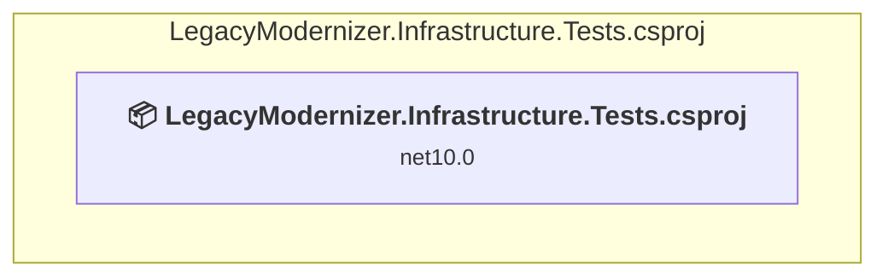
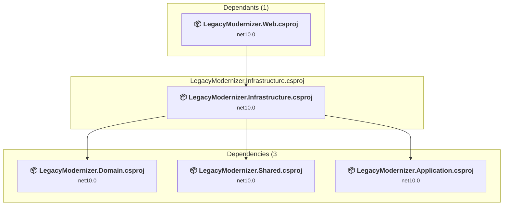
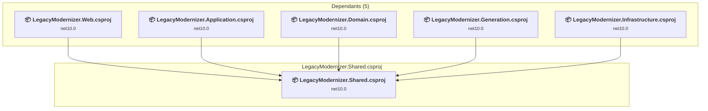
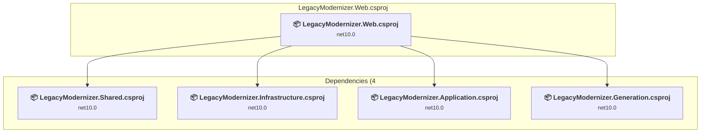

# Projects and dependencies analysis

This document provides a comprehensive overview of the projects and their dependencies in the context of upgrading to .NETCoreApp,Version=v10.0.

## Table of Contents

- [Executive Summary](#executive-Summary)
  - [Highlevel Metrics](#highlevel-metrics)
  - [Projects Compatibility](#projects-compatibility)
  - [Package Compatibility](#package-compatibility)
  - [API Compatibility](#api-compatibility)
- [Aggregate NuGet packages details](#aggregate-nuget-packages-details)
- [Top API Migration Challenges](#top-api-migration-challenges)
  - [Technologies and Features](#technologies-and-features)
  - [Most Frequent API Issues](#most-frequent-api-issues)
- [Projects Relationship Graph](#projects-relationship-graph)
- [Project Details](#project-details)

  - [LegacyModernizer.Application.Tests\LegacyModernizer.Application.Tests.csproj](#legacymodernizerapplicationtestslegacymodernizerapplicationtestscsproj)
  - [LegacyModernizer.Application\LegacyModernizer.Application.csproj](#legacymodernizerapplicationlegacymodernizerapplicationcsproj)
  - [LegacyModernizer.Domain\LegacyModernizer.Domain.csproj](#legacymodernizerdomainlegacymodernizerdomaincsproj)
  - [LegacyModernizer.Generation.Tests\LegacyModernizer.Generation.Tests.csproj](#legacymodernizergenerationtestslegacymodernizergenerationtestscsproj)
  - [LegacyModernizer.Generation\LegacyModernizer.Generation.csproj](#legacymodernizergenerationlegacymodernizergenerationcsproj)
  - [LegacyModernizer.Infrastructure.Tests\LegacyModernizer.Infrastructure.Tests.csproj](#legacymodernizerinfrastructuretestslegacymodernizerinfrastructuretestscsproj)
  - [LegacyModernizer.Infrastructure\LegacyModernizer.Infrastructure.csproj](#legacymodernizerinfrastructurelegacymodernizerinfrastructurecsproj)
  - [LegacyModernizer.Shared\LegacyModernizer.Shared.csproj](#legacymodernizersharedlegacymodernizersharedcsproj)
  - [LegacyModernizer.Web\LegacyModernizer.Web.csproj](#legacymodernizerweblegacymodernizerwebcsproj)

## Executive Summary

### Highlevel Metrics

| Metric | Count | Status |
| :--- | :---: | :--- |
| Total Projects | 9 | 0 require upgrade |
| Total NuGet Packages | 6 | All compatible |
| Total Code Files | 73 |  |
| Total Code Files with Incidents | 0 |  |
| Total Lines of Code | 4574 |  |
| Total Number of Issues | 0 |  |
| Estimated LOC to modify | 0+ | at least 0,0% of codebase |

### Projects Compatibility

| Project | Target Framework | Difficulty | Package Issues | API Issues | Est. LOC Impact | Description |
| :--- | :---: | :---: | :---: | :---: | :---: | :--- |
| [LegacyModernizer.Application.Tests\LegacyModernizer.Application.Tests.csproj](#legacymodernizerapplicationtestslegacymodernizerapplicationtestscsproj) | net10.0 | ✅ None | 0 | 0 |  | DotNetCoreApp, Sdk Style = True |
| [LegacyModernizer.Application\LegacyModernizer.Application.csproj](#legacymodernizerapplicationlegacymodernizerapplicationcsproj) | net10.0 | ✅ None | 0 | 0 |  | ClassLibrary, Sdk Style = True |
| [LegacyModernizer.Domain\LegacyModernizer.Domain.csproj](#legacymodernizerdomainlegacymodernizerdomaincsproj) | net10.0 | ✅ None | 0 | 0 |  | ClassLibrary, Sdk Style = True |
| [LegacyModernizer.Generation.Tests\LegacyModernizer.Generation.Tests.csproj](#legacymodernizergenerationtestslegacymodernizergenerationtestscsproj) | net10.0 | ✅ None | 0 | 0 |  | DotNetCoreApp, Sdk Style = True |
| [LegacyModernizer.Generation\LegacyModernizer.Generation.csproj](#legacymodernizergenerationlegacymodernizergenerationcsproj) | net10.0 | ✅ None | 0 | 0 |  | ClassLibrary, Sdk Style = True |
| [LegacyModernizer.Infrastructure.Tests\LegacyModernizer.Infrastructure.Tests.csproj](#legacymodernizerinfrastructuretestslegacymodernizerinfrastructuretestscsproj) | net10.0 | ✅ None | 0 | 0 |  | DotNetCoreApp, Sdk Style = True |
| [LegacyModernizer.Infrastructure\LegacyModernizer.Infrastructure.csproj](#legacymodernizerinfrastructurelegacymodernizerinfrastructurecsproj) | net10.0 | ✅ None | 0 | 0 |  | ClassLibrary, Sdk Style = True |
| [LegacyModernizer.Shared\LegacyModernizer.Shared.csproj](#legacymodernizersharedlegacymodernizersharedcsproj) | net10.0 | ✅ None | 0 | 0 |  | ClassLibrary, Sdk Style = True |
| [LegacyModernizer.Web\LegacyModernizer.Web.csproj](#legacymodernizerweblegacymodernizerwebcsproj) | net10.0 | ✅ None | 0 | 0 |  | AspNetCore, Sdk Style = True |

### Package Compatibility

| Status | Count | Percentage |
| :--- | :---: | :---: |
| ✅ Compatible | 6 | 100,0% |
| ⚠️ Incompatible | 0 | 0,0% |
| 🔄 Upgrade Recommended | 0 | 0,0% |
| ***Total NuGet Packages*** | ***6*** | ***100%*** |

### API Compatibility

| Category | Count | Impact |
| :--- | :---: | :--- |
| 🔴 Binary Incompatible | 0 | High - Require code changes |
| 🟡 Source Incompatible | 0 | Medium - Needs re-compilation and potential conflicting API error fixing |
| 🔵 Behavioral change | 0 | Low - Behavioral changes that may require testing at runtime |
| ✅ Compatible | 0 |  |
| ***Total APIs Analyzed*** | ***0*** |  |

## Aggregate NuGet packages details

| Package | Current Version | Suggested Version | Projects | Description |
| :--- | :---: | :---: | :--- | :--- |
| coverlet.collector | 6.0.4 |  | [LegacyModernizer.Application.Tests.csproj](#legacymodernizerapplicationtestslegacymodernizerapplicationtestscsproj) [LegacyModernizer.Generation.Tests.csproj](#legacymodernizergenerationtestslegacymodernizergenerationtestscsproj) [LegacyModernizer.Infrastructure.Tests.csproj](#legacymodernizerinfrastructuretestslegacymodernizerinfrastructuretestscsproj) | ✅Compatible |
| Microsoft.Extensions.DependencyInjection | 10.0.6 |  | [LegacyModernizer.Application.csproj](#legacymodernizerapplicationlegacymodernizerapplicationcsproj) | ✅Compatible |
| Microsoft.Extensions.Http | 10.0.6 |  | [LegacyModernizer.Infrastructure.csproj](#legacymodernizerinfrastructurelegacymodernizerinfrastructurecsproj) | ✅Compatible |
| Microsoft.NET.Test.Sdk | 17.14.1 |  | [LegacyModernizer.Application.Tests.csproj](#legacymodernizerapplicationtestslegacymodernizerapplicationtestscsproj) [LegacyModernizer.Generation.Tests.csproj](#legacymodernizergenerationtestslegacymodernizergenerationtestscsproj) [LegacyModernizer.Infrastructure.Tests.csproj](#legacymodernizerinfrastructuretestslegacymodernizerinfrastructuretestscsproj) | ✅Compatible |
| xunit | 2.9.3 |  | [LegacyModernizer.Application.Tests.csproj](#legacymodernizerapplicationtestslegacymodernizerapplicationtestscsproj) [LegacyModernizer.Generation.Tests.csproj](#legacymodernizergenerationtestslegacymodernizergenerationtestscsproj) [LegacyModernizer.Infrastructure.Tests.csproj](#legacymodernizerinfrastructuretestslegacymodernizerinfrastructuretestscsproj) | ✅Compatible |
| xunit.runner.visualstudio | 3.1.4 |  | [LegacyModernizer.Application.Tests.csproj](#legacymodernizerapplicationtestslegacymodernizerapplicationtestscsproj) [LegacyModernizer.Generation.Tests.csproj](#legacymodernizergenerationtestslegacymodernizergenerationtestscsproj) [LegacyModernizer.Infrastructure.Tests.csproj](#legacymodernizerinfrastructuretestslegacymodernizerinfrastructuretestscsproj) | ✅Compatible |

## Top API Migration Challenges

### Technologies and Features

| Technology | Issues | Percentage | Migration Path |
| :--- | :---: | :---: | :--- |

### Most Frequent API Issues

| API | Count | Percentage | Category |
| :--- | :---: | :---: | :--- |

## Projects Relationship Graph

Legend:
📦 SDK-style project
⚙️ Classic project

## Project Details

### LegacyModernizer.Application.Tests\LegacyModernizer.Application.Tests.csproj

#### Project Info

- **Current Target Framework:** net10.0✅
- **SDK-style**: True
- **Project Kind:** DotNetCoreApp
- **Dependencies**: 0
- **Dependants**: 0
- **Number of Files**: 3
- **Lines of Code**: 11
- **Estimated LOC to modify**: 0+ (at least 0,0% of the project)

#### Dependency Graph

Legend:
📦 SDK-style project
⚙️ Classic project

### API Compatibility

| Category | Count | Impact |
| :--- | :---: | :--- |
| 🔴 Binary Incompatible | 0 | High - Require code changes |
| 🟡 Source Incompatible | 0 | Medium - Needs re-compilation and potential conflicting API error fixing |
| 🔵 Behavioral change | 0 | Low - Behavioral changes that may require testing at runtime |
| ✅ Compatible | 0 |  |
| ***Total APIs Analyzed*** | ***0*** |  |

### LegacyModernizer.Application\LegacyModernizer.Application.csproj

#### Project Info

- **Current Target Framework:** net10.0✅
- **SDK-style**: True
- **Project Kind:** ClassLibrary
- **Dependencies**: 2
- **Dependants**: 3
- **Number of Files**: 26
- **Lines of Code**: 419
- **Estimated LOC to modify**: 0+ (at least 0,0% of the project)

#### Dependency Graph

Legend:
📦 SDK-style project
⚙️ Classic project

### API Compatibility

| Category | Count | Impact |
| :--- | :---: | :--- |
| 🔴 Binary Incompatible | 0 | High - Require code changes |
| 🟡 Source Incompatible | 0 | Medium - Needs re-compilation and potential conflicting API error fixing |
| 🔵 Behavioral change | 0 | Low - Behavioral changes that may require testing at runtime |
| ✅ Compatible | 0 |  |
| ***Total APIs Analyzed*** | ***0*** |  |

### LegacyModernizer.Domain\LegacyModernizer.Domain.csproj

#### Project Info

- **Current Target Framework:** net10.0✅
- **SDK-style**: True
- **Project Kind:** ClassLibrary
- **Dependencies**: 1
- **Dependants**: 3
- **Number of Files**: 18
- **Lines of Code**: 629
- **Estimated LOC to modify**: 0+ (at least 0,0% of the project)

#### Dependency Graph

Legend:
📦 SDK-style project
⚙️ Classic project

### API Compatibility

| Category | Count | Impact |
| :--- | :---: | :--- |
| 🔴 Binary Incompatible | 0 | High - Require code changes |
| 🟡 Source Incompatible | 0 | Medium - Needs re-compilation and potential conflicting API error fixing |
| 🔵 Behavioral change | 0 | Low - Behavioral changes that may require testing at runtime |
| ✅ Compatible | 0 |  |
| ***Total APIs Analyzed*** | ***0*** |  |

### LegacyModernizer.Generation.Tests\LegacyModernizer.Generation.Tests.csproj

#### Project Info

- **Current Target Framework:** net10.0✅
- **SDK-style**: True
- **Project Kind:** DotNetCoreApp
- **Dependencies**: 0
- **Dependants**: 0
- **Number of Files**: 3
- **Lines of Code**: 11
- **Estimated LOC to modify**: 0+ (at least 0,0% of the project)

#### Dependency Graph

Legend:
📦 SDK-style project
⚙️ Classic project

### API Compatibility

| Category | Count | Impact |
| :--- | :---: | :--- |
| 🔴 Binary Incompatible | 0 | High - Require code changes |
| 🟡 Source Incompatible | 0 | Medium - Needs re-compilation and potential conflicting API error fixing |
| 🔵 Behavioral change | 0 | Low - Behavioral changes that may require testing at runtime |
| ✅ Compatible | 0 |  |
| ***Total APIs Analyzed*** | ***0*** |  |

### LegacyModernizer.Generation\LegacyModernizer.Generation.csproj

#### Project Info

- **Current Target Framework:** net10.0✅
- **SDK-style**: True
- **Project Kind:** ClassLibrary
- **Dependencies**: 3
- **Dependants**: 1
- **Number of Files**: 7
- **Lines of Code**: 2884
- **Estimated LOC to modify**: 0+ (at least 0,0% of the project)

#### Dependency Graph

Legend:
📦 SDK-style project
⚙️ Classic project

### API Compatibility

| Category | Count | Impact |
| :--- | :---: | :--- |
| 🔴 Binary Incompatible | 0 | High - Require code changes |
| 🟡 Source Incompatible | 0 | Medium - Needs re-compilation and potential conflicting API error fixing |
| 🔵 Behavioral change | 0 | Low - Behavioral changes that may require testing at runtime |
| ✅ Compatible | 0 |  |
| ***Total APIs Analyzed*** | ***0*** |  |

### LegacyModernizer.Infrastructure.Tests\LegacyModernizer.Infrastructure.Tests.csproj

#### Project Info

- **Current Target Framework:** net10.0✅
- **SDK-style**: True
- **Project Kind:** DotNetCoreApp
- **Dependencies**: 0
- **Dependants**: 0
- **Number of Files**: 3
- **Lines of Code**: 11
- **Estimated LOC to modify**: 0+ (at least 0,0% of the project)

#### Dependency Graph

Legend:
📦 SDK-style project
⚙️ Classic project

### API Compatibility

| Category | Count | Impact |
| :--- | :---: | :--- |
| 🔴 Binary Incompatible | 0 | High - Require code changes |
| 🟡 Source Incompatible | 0 | Medium - Needs re-compilation and potential conflicting API error fixing |
| 🔵 Behavioral change | 0 | Low - Behavioral changes that may require testing at runtime |
| ✅ Compatible | 0 |  |
| ***Total APIs Analyzed*** | ***0*** |  |

### LegacyModernizer.Infrastructure\LegacyModernizer.Infrastructure.csproj

#### Project Info

- **Current Target Framework:** net10.0✅
- **SDK-style**: True
- **Project Kind:** ClassLibrary
- **Dependencies**: 3
- **Dependants**: 1
- **Number of Files**: 6
- **Lines of Code**: 292
- **Estimated LOC to modify**: 0+ (at least 0,0% of the project)

#### Dependency Graph

Legend:
📦 SDK-style project
⚙️ Classic project

### API Compatibility

| Category | Count | Impact |
| :--- | :---: | :--- |
| 🔴 Binary Incompatible | 0 | High - Require code changes |
| 🟡 Source Incompatible | 0 | Medium - Needs re-compilation and potential conflicting API error fixing |
| 🔵 Behavioral change | 0 | Low - Behavioral changes that may require testing at runtime |
| ✅ Compatible | 0 |  |
| ***Total APIs Analyzed*** | ***0*** |  |

### LegacyModernizer.Shared\LegacyModernizer.Shared.csproj

#### Project Info

- **Current Target Framework:** net10.0✅
- **SDK-style**: True
- **Project Kind:** ClassLibrary
- **Dependencies**: 0
- **Dependants**: 5
- **Number of Files**: 0
- **Lines of Code**: 0
- **Estimated LOC to modify**: 0+ (at least 0,0% of the project)

#### Dependency Graph

Legend:
📦 SDK-style project
⚙️ Classic project

### API Compatibility

| Category | Count | Impact |
| :--- | :---: | :--- |
| 🔴 Binary Incompatible | 0 | High - Require code changes |
| 🟡 Source Incompatible | 0 | Medium - Needs re-compilation and potential conflicting API error fixing |
| 🔵 Behavioral change | 0 | Low - Behavioral changes that may require testing at runtime |
| ✅ Compatible | 0 |  |
| ***Total APIs Analyzed*** | ***0*** |  |

### LegacyModernizer.Web\LegacyModernizer.Web.csproj

#### Project Info

- **Current Target Framework:** net10.0✅
- **SDK-style**: True
- **Project Kind:** AspNetCore
- **Dependencies**: 4
- **Dependants**: 0
- **Number of Files**: 18
- **Lines of Code**: 317
- **Estimated LOC to modify**: 0+ (at least 0,0% of the project)

#### Dependency Graph

Legend:
📦 SDK-style project
⚙️ Classic project

### API Compatibility

| Category | Count | Impact |
| :--- | :---: | :--- |
| 🔴 Binary Incompatible | 0 | High - Require code changes |
| 🟡 Source Incompatible | 0 | Medium - Needs re-compilation and potential conflicting API error fixing |
| 🔵 Behavioral change | 0 | Low - Behavioral changes that may require testing at runtime |
| ✅ Compatible | 0 |  |
| ***Total APIs Analyzed*** | ***0*** |  |

