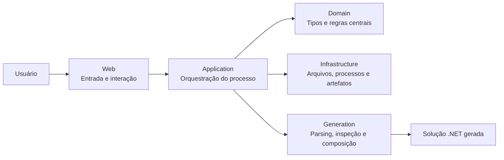
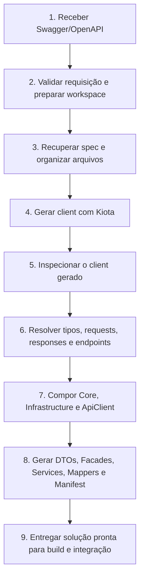

# Legacy Modernizer Toolkit

O `Legacy Modernizer Toolkit` é uma ferramenta para acelerar a modernização do consumo de APIs em projetos legados `.NET`.

Na prática, ele recebe uma especificação `Swagger/OpenAPI`, gera um client com `Microsoft Kiota` e, a partir disso, monta uma solução `.NET` padronizada, com contratos claros, separação de responsabilidades e uma estrutura pronta para ser integrada em ambientes já existentes.

## Objetivo

O objetivo do Toolkit é evitar que sistemas legados continuem concentrando chamadas HTTP, parsing, autenticação e tratamento de endpoints diretamente espalhados pelo código.

Em vez disso, ele cria uma solução intermediária, moderna e organizada, responsável por:

- centralizar o acesso às APIs externas
- reduzir acoplamento com a especificação original
- facilitar manutenção quando endpoints mudarem
- padronizar serviços, facades, DTOs e injeção de dependência
- oferecer uma base mais segura para evolução futura

## O que o Toolkit entrega

Ao final da geração, o Toolkit entrega uma solução `.NET` pronta para uso, contendo:

- client gerado pelo `Kiota`
- camada `Core` com contratos e DTOs próprios
- camada `Infrastructure` com facades, services, mapeadores e DI
- manifesto de geração com os metadados principais da saída
- estrutura organizada para ser reaproveitada em projetos legados

## Visão geral da arquitetura

O projeto foi estruturado em camadas com responsabilidades bem separadas.

Cada camada recebe algo da anterior, executa sua responsabilidade e entrega uma saída clara para a próxima etapa.

## Diagrama da arquitetura

### Visão por camadas

### Fluxo de geração

### Fluxo de alto nível

`Web -> Application -> Domain -> Infrastructure/Generation -> solução gerada`

Em termos práticos, o fluxo funciona assim:

1. A camada `Web` recebe a solicitação do usuário.
2. A camada `Application` orquestra o processo completo.
3. A camada `Domain` fornece os tipos e regras centrais usados no fluxo.
4. A camada `Infrastructure` cuida dos recursos externos e operacionais.
5. A camada `Generation` interpreta a spec, inspeciona o client gerado e compõe a solução final.
6. O usuário recebe uma solução `.NET` pronta para build e integração.

## Camadas do projeto

### Web

É a camada de entrada do Toolkit.

Responsabilidades:

- receber URL, arquivo ou dados da especificação
- iniciar o processo de modernização
- acompanhar o resultado da execução
- apresentar mensagens, erros e artefatos ao usuário

Recebe:

- entradas do usuário pela interface

Entrega para a próxima camada:

- requisição de modernização com os dados necessários para processamento

### Application

É a camada de orquestração do caso de uso.

Responsabilidades:

- validar a solicitação recebida
- organizar o passo a passo da execução
- chamar os serviços corretos na ordem correta
- consolidar o resultado final da modernização

Recebe:

- requisição vinda da camada `Web`

Entrega para a próxima camada:

- comandos e instruções de execução para `Generation` e `Infrastructure`
- resultado final estruturado para retorno à `Web`

### Domain

É a camada central do modelo do Toolkit.

Responsabilidades:

- representar os conceitos principais do processo
- manter entidades, enums, value objects e estados do fluxo
- sustentar consistência conceitual entre as camadas

Recebe:

- dados já tratados pela camada `Application`

Entrega para a próxima camada:

- tipos centrais e regras que guiam toda a execução

Observação:

A camada `Domain` não deveria conhecer detalhes de interface, filesystem, HTTP, Kiota ou UI. Ela representa o núcleo do processo.

### Infrastructure

É a camada que lida com recursos externos e tarefas operacionais.

Responsabilidades:

- baixar ou ler a spec Swagger/OpenAPI
- preparar diretórios de trabalho
- manipular arquivos e artefatos
- executar ferramentas externas quando necessário
- empacotar a saída gerada

Recebe:

- instruções de execução vindas da camada `Application`
- tipos de apoio definidos no `Domain`

Entrega para a próxima camada:

- arquivos locais preparados
- artefatos intermediários
- estrutura física necessária para a geração

### Generation

É a camada mais especializada do Toolkit. Ela concentra a inteligência de geração da solução.

Responsabilidades:

- interpretar a especificação OpenAPI
- agrupar endpoints
- inspecionar o código gerado pelo Kiota
- resolver tipos, parâmetros, requests e responses
- compor a solução final com `ApiClient`, `Core` e `Infrastructure`
- gerar DTOs, facades, services, mappers e manifesto

Recebe:

- spec validada
- artefatos preparados pela `Infrastructure`
- metadados do processo orquestrados pela `Application`

Entrega para a próxima camada:

- solução `.NET` modernizada pronta para build

## Como a solução gerada é organizada

Hoje a solução gerada costuma ser dividida em três projetos principais:

### Projeto `ApiClient`

Contém o client gerado pelo `Kiota`.

Responsabilidade:

- encapsular o acesso bruto à API conforme a spec OpenAPI

Entrada:

- arquivos gerados pelo Kiota

Saída:

- classes de client, request builders e modelos gerados

### Projeto `Core`

Contém os contratos e os DTOs próprios da solução gerada.

Responsabilidade:

- definir o que a solução expõe de forma estável para consumo
- desacoplar o restante da aplicação dos tipos brutos do Kiota

Entrada:

- tipos identificados durante a inspeção do client gerado

Saída:

- interfaces
- DTOs
- contratos de fachada e serviços

### Projeto `Infrastructure`

Contém a implementação da integração.

Responsabilidade:

- usar o client do Kiota internamente
- mapear tipos do Kiota para DTOs próprios
- centralizar chamadas de API em facades e services
- registrar dependências para DI

Entrada:

- client gerado
- contratos e DTOs do `Core`

Saída:

- implementação concreta pronta para ser plugada em sistemas legados

## Como o Toolkit foi pensado

O Toolkit foi pensado para funcionar como uma ponte entre dois mundos:

- o mundo da API moderna, documentada por OpenAPI
- o mundo do sistema legado, que precisa consumir essa API com previsibilidade

Por isso, a arquitetura foi desenhada para separar claramente:

- entrada do processo
- orquestração
- regras centrais
- execução operacional
- geração especializada
- solução final gerada

Essa separação traz ganhos importantes:

- facilita manutenção do próprio Toolkit
- reduz risco ao evoluir regras de geração
- permite testar etapas críticas com mais precisão
- melhora previsibilidade quando uma nova spec Swagger for utilizada

## Manifesto de geração

Além da solução gerada, o Toolkit também cria um arquivo `generation-manifest.json`.

Esse arquivo registra informações úteis da geração, como:

- nome do projeto
- namespace base
- framework alvo
- client Kiota detectado
- mapeamentos entre tipos do Kiota e DTOs gerados
- grupos e endpoints processados
- contratos expostos pela solução

Ele ajuda em auditoria, suporte, troubleshooting e entendimento da saída gerada.

## Testes de geração

O projeto possui testes de regressão em `LegacyModernizer.Generation.Tests`.

Esses testes protegem principalmente os pontos mais sensíveis da evolução do Toolkit, como:

- parsing do Swagger/OpenAPI
- inspeção do client gerado pelo Kiota
- resolução de requests, responses e path parameters
- composição final da solução
- conteúdo de arquivos gerados

Os testes do tipo golden file usam arquivos `.snap`.

O motivo é simples:

- `.snap` deixa claro que o arquivo é um snapshot de comparação
- evita que o SDK do `.NET` trate o arquivo como código compilável
- facilita manutenção dos artefatos esperados

## Stack principal

- `.NET 10`
- `ASP.NET Core`
- `Razor Pages`
- `Microsoft Kiota`
- filesystem local
- geração e empacotamento de artefatos

## Stacks envolvidas

O Toolkit foi construído com uma combinação de stacks e componentes voltados para geração de código, composição de solução e integração com APIs.

### Stack do Toolkit

- `.NET 10` como base da aplicação
- `ASP.NET Core` para hospedagem da aplicação web
- `Razor Pages` para a interface de uso do Toolkit
- `C#` como linguagem principal
- `System.Text.Json` para leitura e escrita de metadados e manifestos
- filesystem local para preparação, composição e empacotamento dos artefatos

### Stack de geração e integração

- `OpenAPI / Swagger` como contrato de entrada
- `Microsoft Kiota` para geração do client tipado
- `dotnet CLI` para criação e composição da solução gerada
- `Microsoft.Extensions.DependencyInjection` para registro de dependências
- `HttpClient` e bibliotecas do ecossistema `Kiota` para consumo de APIs

### Stack da solução gerada

Na saída, a solução gerada normalmente usa:

- `.NET` como runtime do projeto gerado
- `Kiota` como client HTTP gerado
- `DTOs` próprios para contratos internos
- `Services` e `Facades` como camada de acesso padronizado
- `Dependency Injection` para composição das dependências
- `Mappers` para conversão entre tipos do Kiota e tipos expostos pela solução

## Patterns adotados

O Toolkit não foi pensado apenas para gerar código, mas para gerar código com organização previsível. Para isso, alguns patterns e abordagens arquiteturais foram adotados.

### Patterns arquiteturais do Toolkit

- `Separation of Concerns`
  Cada camada possui um papel claro e evita assumir responsabilidades da outra.

- `Clean Architecture simplificada`
  O projeto separa entrada, orquestração, domínio, infraestrutura e geração para reduzir acoplamento e facilitar evolução.

- `Pipeline de processamento`
  A modernização acontece em etapas encadeadas: receber spec, validar, preparar workspace, gerar client, inspecionar saída e compor solução.

- `Ports and Adapters` em estilo leve
  A lógica principal depende de contratos; detalhes externos, como filesystem e execução operacional, ficam nas bordas.

### Patterns usados na solução gerada

- `Facade`
  As facades centralizam a comunicação com os endpoints e escondem os detalhes do client gerado pelo Kiota.

- `Service Layer`
  Os services organizam o acesso funcional por grupo de API e expõem uma interface mais estável para o sistema consumidor.

- `DTO`
  Os contratos da solução gerada usam objetos próprios para evitar espalhar tipos do Kiota pelo restante da aplicação.

- `Mapper`
  Mapeadores convertem requests e responses entre os tipos do Kiota e os DTOs expostos pela solução gerada.

- `Dependency Injection`
  Toda a composição da integração é preparada para ser registrada e consumida via DI.

- `Generated Client Adapter`
  O client do Kiota funciona como base técnica de acesso HTTP, enquanto a solução gerada o adapta para um modelo mais apropriado ao legado.

### Benefício desses patterns

O uso combinado desses patterns ajuda a garantir:

- menor acoplamento com a API externa
- maior legibilidade da integração
- menos impacto quando a spec mudar
- melhor testabilidade
- mais segurança para evoluir projetos legados gradualmente

## Para quem este projeto é útil

O Toolkit é especialmente útil para equipes que:

- mantêm sistemas legados em `.NET`
- consomem múltiplas APIs externas
- sofrem com falta de padrão nas integrações
- querem evoluir a arquitetura sem reescrever tudo de uma vez
- precisam acelerar onboarding e manutenção

## Resumo final

Em resumo, o `Legacy Modernizer Toolkit` não é apenas um gerador de client.

Ele é um gerador de solução arquitetural para consumo de APIs, pensado para criar uma camada moderna, organizada e sustentável entre sistemas legados e APIs baseadas em OpenAPI.
